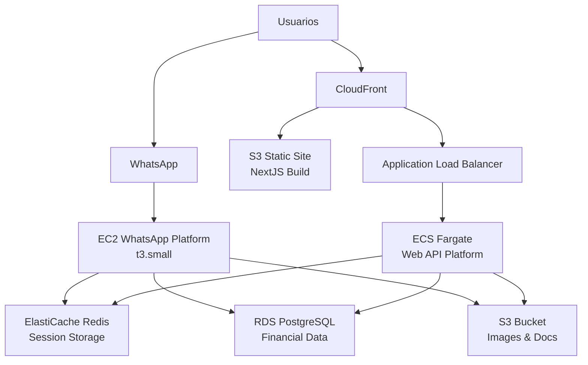
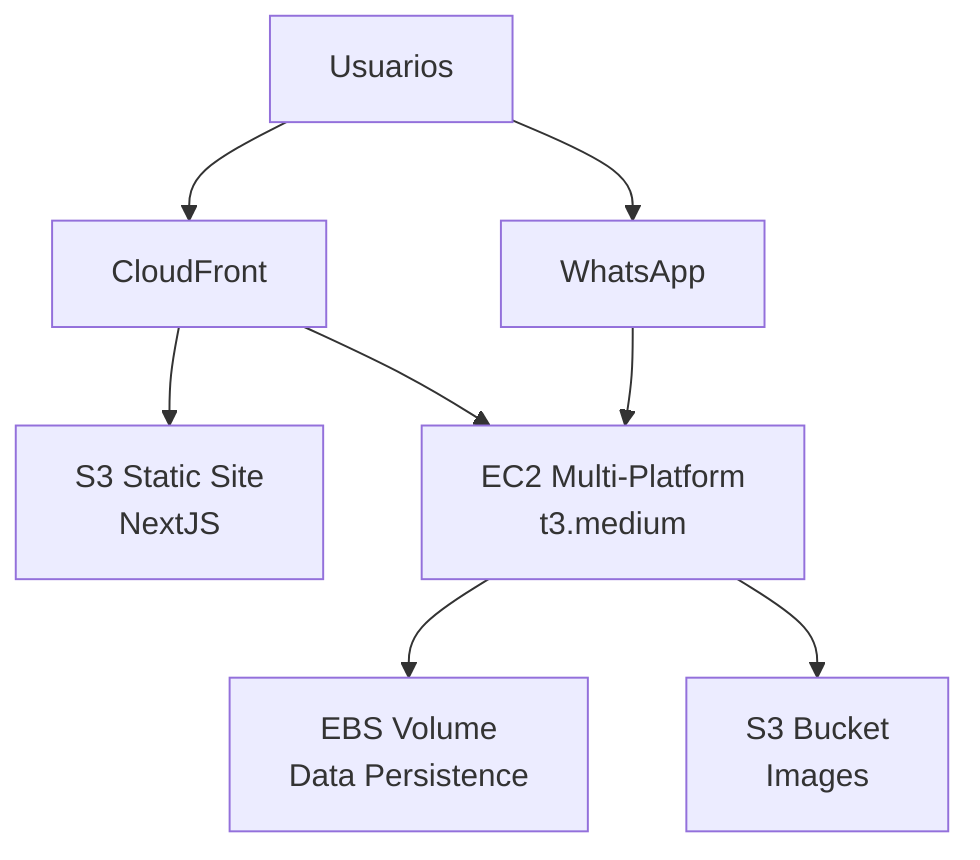
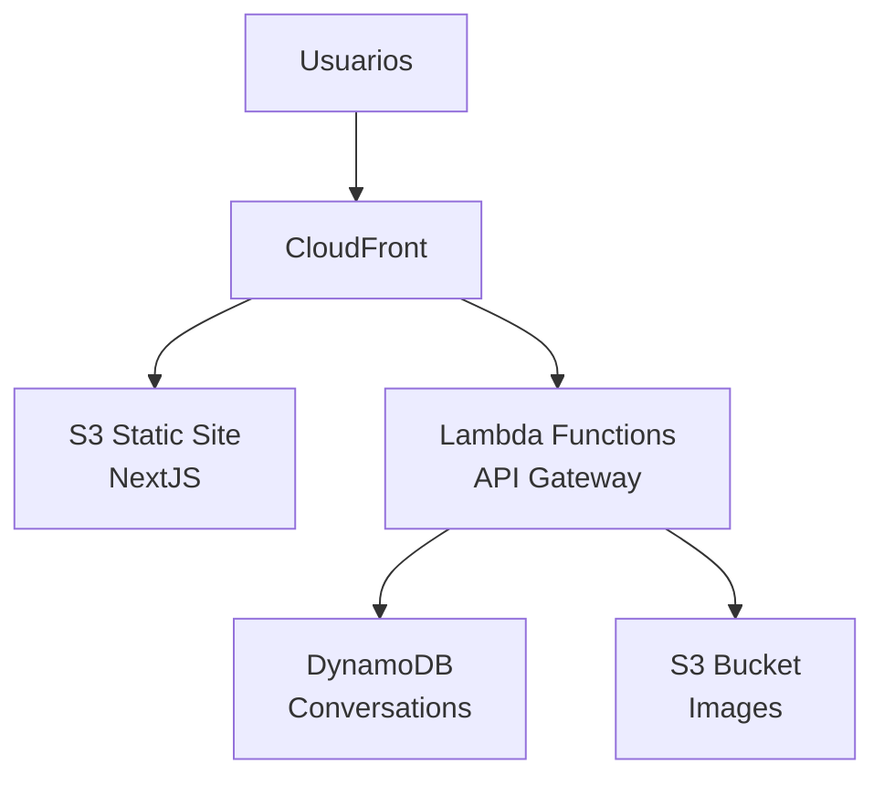

# SofIA Finance Advisor - Guía de Despliegue

## 🏗️ Arquitectura de Despliegue Recomendada

### 📊 Resumen de Componentes y Servicios AWS

| Componente | Servicio AWS Recomendado | Alternativa | Justificación |
|------------|--------------------------|-------------|---------------|
| **WhatsApp Platform** | EC2 (t3.small) | ECS Fargate | Necesita estado persistente para sesión WhatsApp |
| **Web API** | ECS Fargate | Lambda | Mejor para WebSocket y conexiones persistentes |
| **NextJS WebApp** | Vercel / Amplify | S3 + CloudFront | Optimizado para aplicaciones React |
| **Base de Datos** | RDS PostgreSQL | DynamoDB | Datos relacionales financieros |
| **Cache/Sessions** | ElastiCache Redis | MemoryDB | Sesiones y cache de IA |
| **File Storage** | S3 | EFS | Imágenes y documentos financieros |
| **Load Balancer** | ALB | CloudFront | Balance y SSL para APIs |
| **Monitoring** | CloudWatch | DataDog | Logs y métricas |

## 🚀 Opciones de Despliegue

### Opción 1: Arquitectura Microservicios (Recomendada para Producción)



### Opción 2: Arquitectura Simplificada (Desarrollo/MVP)



### Opción 3: Serverless (Solo Web)



## 🔧 Configuración por Componente

### 1. WhatsApp Platform (EC2)

**Instancia Recomendada**: `t3.small` (2 vCPU, 2 GB RAM)

```bash
# Configuración EC2
Instance Type: t3.small
OS: Amazon Linux 2
Storage: 20 GB gp3
Security Group: Inbound 22 (SSH), Outbound All

# User Data Script
#!/bin/bash
yum update -y
curl -fsSL https://rpm.nodesource.com/setup_18.x | bash -
yum install -y nodejs git

# Auto-start script
cat > /etc/systemd/system/sofia-whatsapp.service << EOF
[Unit]
Description=SofIA WhatsApp Platform
After=network.target

[Service]
Type=simple
User=ec2-user
WorkingDirectory=/home/ec2-user/sofia
ExecStart=/usr/bin/node src/platforms/whatsapp/server.js
Restart=always
RestartSec=10
Environment=NODE_ENV=production

[Install]
WantedBy=multi-user.target
EOF

systemctl enable sofia-whatsapp
```

**Consideraciones Especiales**:
- Requiere estado persistente para sesión WhatsApp
- EBS volume para datos de autenticación
- Auto Scaling NO recomendado (pérdida de sesión)
- Backup diario de volumen EBS

### 2. Web API Platform (ECS Fargate)

**Configuración Fargate**:
```yaml
# task-definition.json
{
  "family": "sofia-web-api",
  "networkMode": "awsvpc",
  "requiresCompatibilities": ["FARGATE"],
  "cpu": "512",
  "memory": "1024",
  "executionRoleArn": "arn:aws:iam::ACCOUNT:role/ecsTaskExecutionRole",
  "taskRoleArn": "arn:aws:iam::ACCOUNT:role/ecsTaskRole",
  "containerDefinitions": [
    {
      "name": "sofia-web-api",
      "image": "YOUR_ECR_REPO/sofia-web-api:latest",
      "portMappings": [
        {
          "containerPort": 3001,
          "protocol": "tcp"
        }
      ],
      "environment": [
        {
          "name": "NODE_ENV",
          "value": "production"
        },
        {
          "name": "API_PORT",
          "value": "3001"
        }
      ],
      "secrets": [
        {
          "name": "PERPLEXITY_API_KEY",
          "valueFrom": "arn:aws:secretsmanager:REGION:ACCOUNT:secret:sofia/perplexity:API_KEY"
        }
      ],
      "logConfiguration": {
        "logDriver": "awslogs",
        "options": {
          "awslogs-group": "/ecs/sofia-web-api",
          "awslogs-region": "us-east-1",
          "awslogs-stream-prefix": "ecs"
        }
      }
    }
  ]
}
```

**Auto Scaling**:
```yaml
# Auto scaling para Web API
Min Capacity: 1
Max Capacity: 10
Target CPU: 70%
Target Memory: 80%
Scale Out Cooldown: 300s
Scale In Cooldown: 300s
```

### 3. NextJS WebApp

#### Opción A: Vercel (Recomendada)
```bash
# Deploy automático con Git
npm install -g vercel
vercel --prod

# Variables de entorno en Vercel
NEXT_PUBLIC_API_URL=https://api.sofia.com
```

#### Opción B: AWS Amplify
```yaml
# amplify.yml
version: 1
applications:
  - frontend:
      phases:
        preBuild:
          commands:
            - cd webapp
            - npm ci
        build:
          commands:
            - npm run build
      artifacts:
        baseDirectory: webapp/.next
        files:
          - '**/*'
      cache:
        paths:
          - webapp/node_modules/**/*
```

#### Opción C: S3 + CloudFront
```bash
# Build estático
cd webapp
npm run build
npm run export

# Deploy a S3
aws s3 sync out/ s3://sofia-webapp-bucket --delete
aws cloudfront create-invalidation --distribution-id E123456789 --paths "/*"
```

### 4. Base de Datos (RDS PostgreSQL)

```terraform
resource "aws_db_instance" "sofia_postgres" {
  identifier = "sofia-finance-db"
  
  engine         = "postgres"
  engine_version = "15.4"
  instance_class = "db.t3.micro"
  
  allocated_storage     = 20
  max_allocated_storage = 100
  storage_encrypted     = true
  
  db_name  = "sofia_finance"
  username = "sofia_admin"
  password = var.db_password
  
  vpc_security_group_ids = [aws_security_group.rds.id]
  db_subnet_group_name   = aws_db_subnet_group.sofia.name
  
  backup_retention_period = 7
  backup_window          = "03:00-04:00"
  maintenance_window     = "sun:04:00-sun:05:00"
  
  skip_final_snapshot = false
  final_snapshot_identifier = "sofia-final-snapshot"
  
  tags = {
    Name = "SofIA Finance Database"
  }
}
```

### 5. Cache/Sessions (ElastiCache Redis)

```terraform
resource "aws_elasticache_replication_group" "sofia_redis" {
  replication_group_id         = "sofia-sessions"
  description                  = "Redis cluster for SofIA sessions"
  
  engine               = "redis"
  node_type           = "cache.t3.micro"
  port                = 6379
  parameter_group_name = "default.redis7"
  
  num_cache_clusters = 2
  
  subnet_group_name  = aws_elasticache_subnet_group.sofia.name
  security_group_ids = [aws_security_group.redis.id]
  
  at_rest_encryption_enabled = true
  transit_encryption_enabled = true
  
  maintenance_window = "sun:05:00-sun:06:00"
  snapshot_window    = "03:00-05:00"
  snapshot_retention_limit = 7
}
```

## 💰 Estimación de Costos (us-east-1)

### Opción 1: Microservicios (Producción)
| Servicio | Especificación | Costo Mensual |
|----------|----------------|---------------|
| EC2 WhatsApp | t3.small (24/7) | ~$15 |
| ECS Fargate Web API | 0.5 vCPU, 1GB (24/7) | ~$25 |
| RDS PostgreSQL | db.t3.micro | ~$15 |
| ElastiCache Redis | cache.t3.micro | ~$15 |
| ALB | Standard | ~$20 |
| S3 + CloudFront | 100GB transfer | ~$10 |
| **Total Estimado** | | **~$100/mes** |

### Opción 2: Simplificada (MVP)
| Servicio | Especificación | Costo Mensual |
|----------|----------------|---------------|
| EC2 Multi-Platform | t3.medium (24/7) | ~$30 |
| EBS Storage | 20GB gp3 | ~$2 |
| S3 + CloudFront | 50GB transfer | ~$5 |
| **Total Estimado** | | **~$37/mes** |

### Opción 3: Serverless (Solo Web)
| Servicio | Especificación | Costo Mensual |
|----------|----------------|---------------|
| Lambda | 1M requests, 512MB | ~$5 |
| API Gateway | 1M requests | ~$3 |
| DynamoDB | 25GB, on-demand | ~$10 |
| S3 + CloudFront | 25GB transfer | ~$3 |
| **Total Estimado** | | **~$21/mes** |

## 🚀 Scripts de Despliegue

### Deploy Automatizado con Terraform

```hcl
# main.tf
terraform {
  required_providers {
    aws = {
      source  = "hashicorp/aws"
      version = "~> 5.0"
    }
  }
}

provider "aws" {
  region = var.aws_region
}

# Módulos
module "vpc" {
  source = "./modules/vpc"
}

module "security_groups" {
  source = "./modules/security"
  vpc_id = module.vpc.vpc_id
}

module "database" {
  source = "./modules/rds"
  vpc_id = module.vpc.vpc_id
  subnet_ids = module.vpc.private_subnet_ids
  security_group_ids = [module.security_groups.rds_sg_id]
}

module "cache" {
  source = "./modules/elasticache"
  vpc_id = module.vpc.vpc_id
  subnet_ids = module.vpc.private_subnet_ids
  security_group_ids = [module.security_groups.redis_sg_id]
}

module "ecs" {
  source = "./modules/ecs"
  vpc_id = module.vpc.vpc_id
  subnet_ids = module.vpc.private_subnet_ids
  security_group_ids = [module.security_groups.ecs_sg_id]
  
  database_url = module.database.connection_string
  redis_url = module.cache.primary_endpoint
}

module "ec2_whatsapp" {
  source = "./modules/ec2"
  vpc_id = module.vpc.vpc_id
  subnet_id = module.vpc.public_subnet_ids[0]
  security_group_ids = [module.security_groups.ec2_sg_id]
}

module "load_balancer" {
  source = "./modules/alb"
  vpc_id = module.vpc.vpc_id
  subnet_ids = module.vpc.public_subnet_ids
  security_group_ids = [module.security_groups.alb_sg_id]
  target_group_arn = module.ecs.target_group_arn
}
```

### GitHub Actions Pipeline

```yaml
# .github/workflows/deploy.yml
name: Deploy SofIA Finance Advisor

on:
  push:
    branches: [main]
  pull_request:
    branches: [main]

jobs:
  test:
    runs-on: ubuntu-latest
    steps:
      - uses: actions/checkout@v4
      - uses: actions/setup-node@v4
        with:
          node-version: '18'
      - run: npm ci
      - run: npm test

  build-and-deploy-api:
    needs: test
    runs-on: ubuntu-latest
    if: github.ref == 'refs/heads/main'
    
    steps:
      - uses: actions/checkout@v4
      
      - name: Configure AWS credentials
        uses: aws-actions/configure-aws-credentials@v4
        with:
          aws-access-key-id: ${{ secrets.AWS_ACCESS_KEY_ID }}
          aws-secret-access-key: ${{ secrets.AWS_SECRET_ACCESS_KEY }}
          aws-region: us-east-1

      - name: Login to Amazon ECR
        id: login-ecr
        uses: aws-actions/amazon-ecr-login@v2

      - name: Build and push Web API image
        env:
          ECR_REGISTRY: ${{ steps.login-ecr.outputs.registry }}
          ECR_REPOSITORY: sofia-web-api
          IMAGE_TAG: ${{ github.sha }}
        run: |
          docker build -f Dockerfile.web-api -t $ECR_REGISTRY/$ECR_REPOSITORY:$IMAGE_TAG .
          docker push $ECR_REGISTRY/$ECR_REPOSITORY:$IMAGE_TAG

      - name: Update ECS service
        run: |
          aws ecs update-service \
            --cluster sofia-cluster \
            --service sofia-web-api \
            --force-new-deployment

  deploy-webapp:
    needs: test
    runs-on: ubuntu-latest
    if: github.ref == 'refs/heads/main'
    
    steps:
      - uses: actions/checkout@v4
      - uses: actions/setup-node@v4
        with:
          node-version: '18'
      
      - name: Install and build webapp
        run: |
          cd webapp
          npm ci
          npm run build
      
      - name: Deploy to Vercel
        uses: amondnet/vercel-action@v25
        with:
          vercel-token: ${{ secrets.VERCEL_TOKEN }}
          vercel-org-id: ${{ secrets.VERCEL_ORG_ID }}
          vercel-project-id: ${{ secrets.VERCEL_PROJECT_ID }}
          working-directory: ./webapp
```

## 🔐 Seguridad y Mejores Prácticas

### 1. Secrets Management
```bash
# Almacenar API keys en AWS Secrets Manager
aws secretsmanager create-secret \
  --name "sofia/perplexity" \
  --description "Perplexity API Key for SofIA" \
  --secret-string '{"API_KEY":"your-api-key-here"}'
```

### 2. Network Security
- VPC con subnets públicas y privadas
- Security Groups restrictivos
- WAF para Web API
- NACLs para defensa en profundidad

### 3. Data Protection
- Encriptación en tránsito (TLS 1.3)
- Encriptación en reposo (AES-256)
- Backups automáticos encriptados
- Rotación de secretos

### 4. Monitoring y Alertas
```yaml
# CloudWatch Alarms
CPU_High:
  Threshold: 80%
  Action: Scale Out

Memory_High:
  Threshold: 85%
  Action: Scale Out

Error_Rate:
  Threshold: 5%
  Action: SNS Alert

Response_Time:
  Threshold: 2000ms
  Action: SNS Alert
```

## 📈 Escalabilidad

### Auto Scaling Policies
```yaml
Web API:
  Min: 1
  Max: 10
  Target CPU: 70%
  Scale Out: +2 instances when CPU > 70% for 2 minutes
  Scale In: -1 instance when CPU < 30% for 5 minutes

Database:
  Read Replicas: Auto-create when CPU > 70%
  Storage: Auto-scaling enabled (20GB to 1TB)

Cache:
  Multi-AZ: Enabled
  Backup: Daily snapshots
```

### Performance Optimization
- CloudFront para assets estáticos
- Redis para cache de respuestas IA
- Connection pooling en RDS
- Lazy loading en NextJS
- Image optimization automática

## 🎯 Recomendación Final

**Para MVP/Desarrollo**: Usar Opción 2 (Simplificada)
- Menor costo (~$37/mes)
- Fácil mantenimiento
- Escalable cuando sea necesario

**Para Producción**: Usar Opción 1 (Microservicios)
- Alta disponibilidad
- Escalabilidad independiente
- Mejor separación de responsabilidades
- Monitoring granular

**Para Solo Web**: Usar Opción 3 (Serverless)
- Menor costo inicial
- Pay-per-use
- Auto-scaling automático
- Sin mantenimiento de servidores 